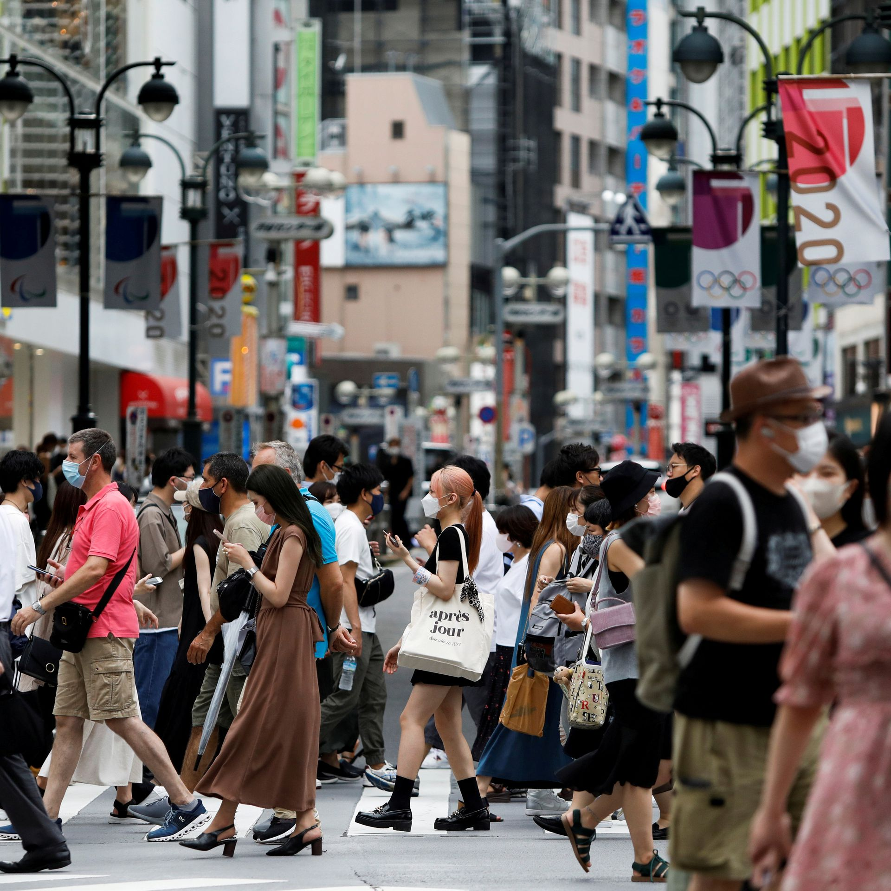
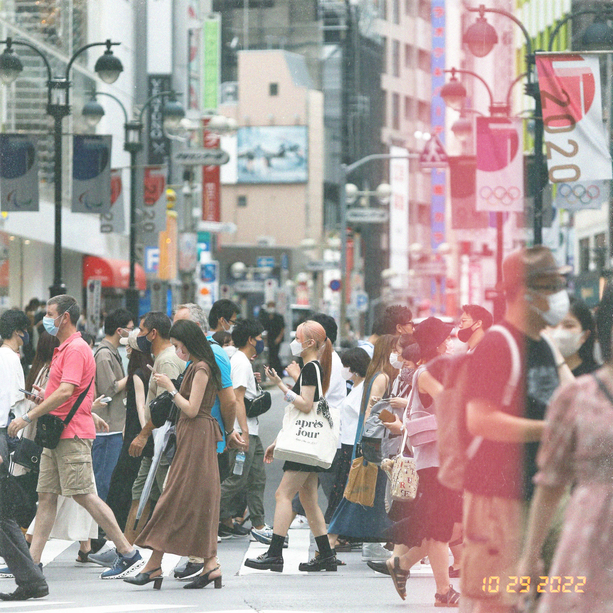

# 35mm Film Camera Filter
---
Makes photo look like they were taken with a 35mm analog camera.

## Usage
```bash
filmcamera [OPTIONS] --output <OUTPUT> <INPUT_FILE>
```

### CLI Options
```bash
  -n, --noise-intensity <NOISE_INTENSITY>
          Standard deviation for gaussian distribution [default: 0.08]
  -g, --grayscale-noise
          Use grayscale noise
  -t, --timestamp
          Add timestamp to final image
  -o, --output <OUTPUT>
          Output destination
  -h, --help
          Print help information
  -V, --version
          Print version information
```

### Example
```bash
filmcamera -n="0.1" -t --output output.jpg input.jpg
```

<div style="display: flex; justify-content: space-evenly">
    <figure style="display: inline-block">
        
        <figcaption>input.jpg</figcaption>
    </figure>
    <figure style="display: inline-block">
        
        <figcaption>output.jpg</figcaption>
    </figure>

</div>

---

## Image Processing Todo
- [ ] Contrast/Curve
- [x] Noise
- [x] Dust/Grain
- [x] Light leak
- [x] Timestamp